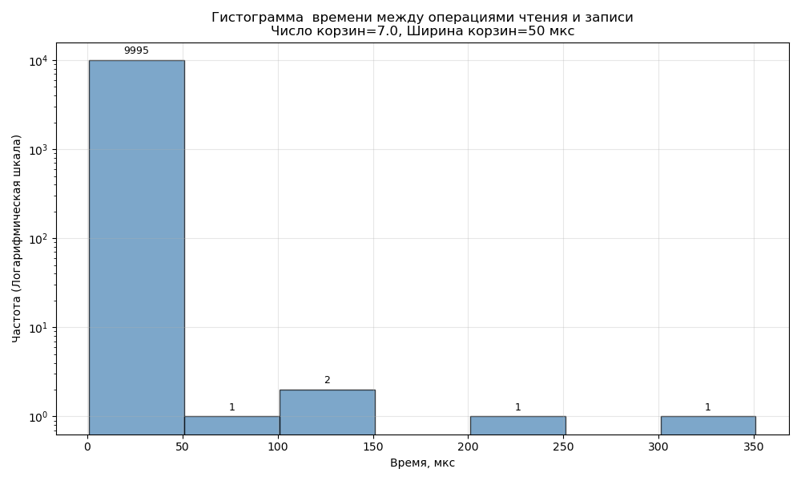

# Символьный драйвер в Linux

## Цель
Измерить время взаимодействия между пространством ядра и пользовательским приложением при операциях `read` и `write` в символьном драйвере Linux и визуализировать результаты в виде гистограммы.

---

## Структура проекта
├── char_driver.c # Исходный код символьного драйвера
├── test_app.c # Пользовательское приложение для тестирования
├── plot_fixed_bin_size.py # Скрипт построения гистограммы
├── output.csv # Измеренные времена (в наносекундах)
├── histogram.png # Результирующая гистограмма
└── README.md

## Описание работы
1. `char_driver.c` регистрирует символьное устройство с функциями `read`, `write`, `ioctl`.  
2. Один из обработчиков `ioctl`, обозначенный как **`MEASURED_TIME`**, возвращает разницу времени между последними операциями чтения и записи.  
3. `test_app.c` выполняет 10 000 пар чтения/записи, получает время через `ioctl(MEASURED_TIME)` и сохраняет данные в `output.csv`.  
4. `plot_fixed_bin_size.py` строит гистограмму с шагом 50 мкс.  
 

## Результат
Гистограмма времени отклика между операциями `read` и `write`:

