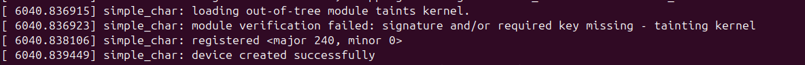
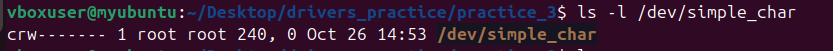
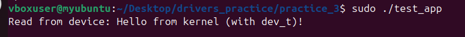
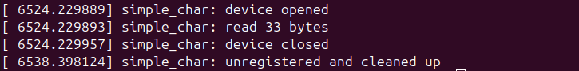

# Отчет ПЗ 3

## 🔹 Цель работы

* Скомпилировать символьный драйвер
* Вставить в ядро
* Создать специальный файл устройства
* Написать пользовательское приложение, которое открывает специальный файл устройства

---

## 🔹 Ход выполнения

### 1. Создание символьного драйвера

Был реализован драйвер **simple_char.c**, который:

* Регистрирует устройство с помощью `alloc_chrdev_region()`;
* Инициализирует структуру `cdev` и регистрирует её через `cdev_add()`;
* Создаёт класс и устройство в `/dev` с помощью `class_create()` и `device_create()`;
* Реализует функции `open()`, `release()` и `read()`.

**Основные структуры и функции:**

```c
dev_t dev_num;
struct cdev simple_cdev;
struct class *simple_class;
struct device *simple_device;
```

---

### 2. Компиляция модуля

Использован `Makefile`:

```makefile
obj-m += simple_char.o

all:
	make -C /lib/modules/$(shell uname -r)/build M=$(PWD) modules
```

Компиляция:

```bash
make
```

---

### 3. Загрузка модуля

```bash
sudo insmod simple_char.ko
dmesg | tail
```

Вывод ядра:



---

### 4. Автоматическое создание файла устройства

После загрузки драйвера автоматически создаётся:



---

### 5. Тестовое приложение

Пользовательское приложение открывает созданный драйвер устройства в каталоге `/dev/`, считывает из него данные с помощью системного вызова `read()` и выводит полученную строку на экран.
Таким образом, оно демонстрирует взаимодействие между пространством пользователя и пространством ядра.




---

### 6. Проверка и выгрузка

```bash
lsmod | grep simple_char
sudo rmmod simple_char
dmesg | tail
```

Вывод:




---

## 🔹 Вывод
 
В ходе работы был создан и протестирован символьный драйвер ядра Linux.
Специальный файл устройства создается автоматически с помощью функций **class_create()** и **device_create()**
