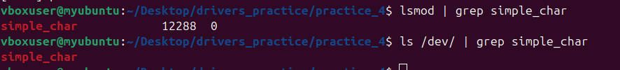
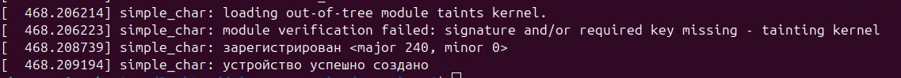
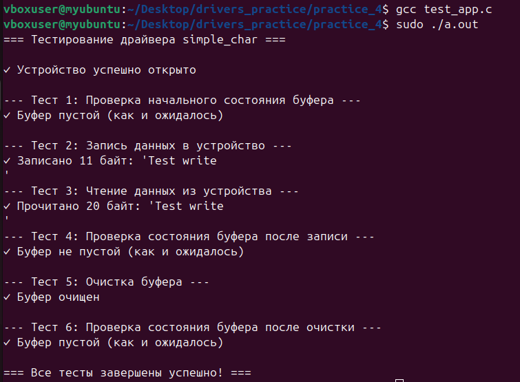
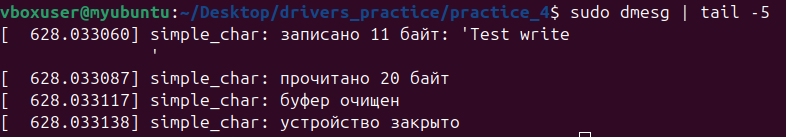
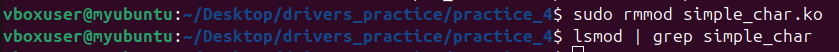

# Practice 4: Символьный драйвер с IOCTL командами

## Описание

Этот проект представляет собой простой символьный драйвер для Linux с внутренним буфером размером 20 байт. Драйвер поддерживает базовые операции чтения/записи и две IOCTL команды для управления буфером.

### Возможности драйвера

- **Чтение и запись данных**: пользователь может записывать данные в буфер драйвера (до 20 байт) и читать их обратно
- **Внутренний буфер**: фиксированный размер 20 байт
- **IOCTL команды**:
  - `IS_EMPTY` - проверка, пуст ли буфер
  - `CLEAR_BUFFER` - очистка содержимого буфера

### Файлы проекта

```
practice_4/
├── simple_char.c    # Исходный код драйвера
├── test_app.c       # Тестовое приложение
├── Makefile         # Makefile для сборки драйвера
└── README.md        # Этот файл
```

## Компиляция и установка

### 1. Компиляция драйвера

```bash
# Переход в директорию проекта
cd practice_4

# Сборка модуля ядра
make

# Если нужно очистить скомпилированные файлы
make clean
```

### 2. Загрузка драйвера в ядро

```bash
# Загрузка модуля
sudo insmod simple_char.ko

# Проверка, что модуль загружен
lsmod | grep simple_char
ls /dev/ | grep simple_char

# Просмотр сообщений ядра
dmesg | tail -20
```

После загрузки модуля автоматически создастся файл устройства `/dev/simple_char`.

### 3. Компиляция тестового приложения

```bash
# Компиляция test_app
gcc -o test_app test_app.c

# Или с флагами для отладки
gcc -Wall -Wextra -o test_app test_app.c
```

### 4. Запуск тестового приложения

```bash
# Запуск тестов
sudo ./test_app
```

Тестовое приложение выполнит следующие операции:
1. Проверит, что буфер изначально пустой
2. Запишет данные в устройство
3. Прочитает данные из устройства
4. Проверит, что буфер не пустой
5. Очистит буфер
6. Проверит, что буфер снова пустой

### 5. Выгрузка драйвера

```bash
# Выгрузка модуля из ядра
sudo rmmod simple_char

# Проверка сообщений ядра
dmesg | tail -10
```

## Ручное тестирование

Вы можете вручную работать с драйвером через командную строку:

### Запись данных

```bash
# Запись строки в устройство
echo "Hello, Driver!" | sudo tee /dev/simple_char
```

### Чтение данных

```bash
# Чтение данных из устройства
sudo cat /dev/simple_char
```

### Просмотр логов ядра

```bash
# Просмотр сообщений драйвера
sudo dmesg | grep simple_char
```

## Структура кода

### simple_char.c

Драйвер реализует следующие операции:

- `dev_open()` - открытие устройства
- `dev_release()` - закрытие устройства
- `dev_read()` - чтение из буфера
- `dev_write()` - запись в буфер (максимум 19 байт + нуль-терминатор)
- `dev_ioctl()` - обработка IOCTL команд:
  - `IS_EMPTY` - возвращает статус буфера (пустой/не пустой)
  - `CLEAR_BUFFER` - очищает буфер

## Результаты

<figure>
  
  <figcaption>Вставка скомпилированного драйвера в ядро</figcaption>
</figure>

<figure>
  
  <figcaption>Вывод драйвера при запуске</figcaption>
</figure>

<figure>
  
  <figcaption>Вывод пользовательского приложения</figcaption>
</figure>

<figure>
  
  <figcaption>Вывод драйвера после отработки пользовательского приложения</figcaption>
</figure>

<figure>
  
  <figcaption>Удаление драйвера из ядра</figcaption>
</figure>