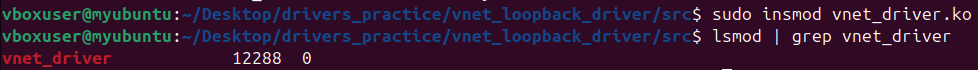
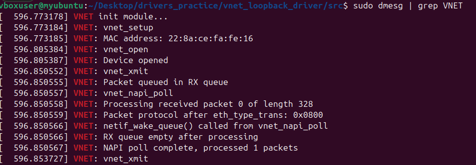
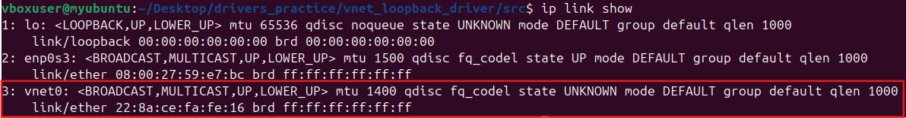
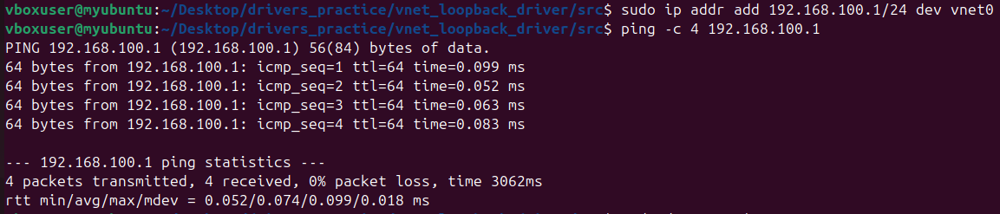
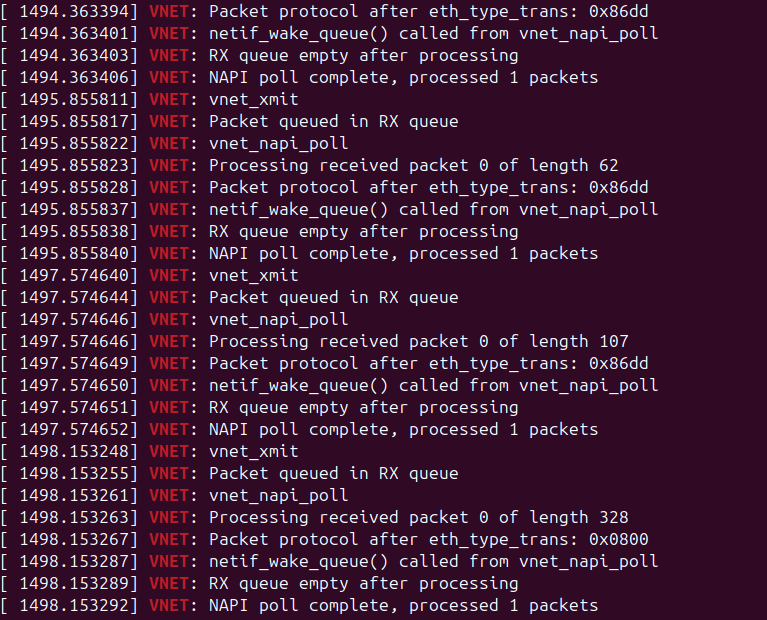
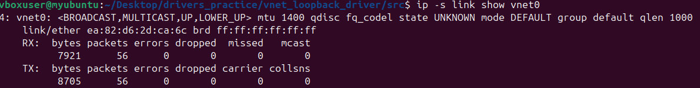
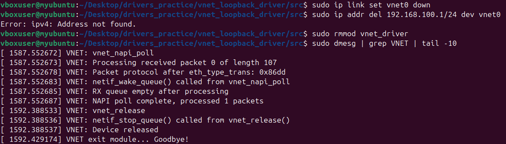

# Virtual Ethernet Loopback Driver in Linux Kernel

## What is the goal of the driver?
This driver is used to feed transmitted packages back to rx networking kernel stack.
This means, the driver receives packages for transmission from kernel, but it does not transmit to a real device, but rather eneques them in the local memory. Then the driver imitates received packages from the real device and sends to the user space the enqueued packages (the same packages it received from the kernel)

## Packet movement in the driver
On the image you can see, how package travels in the Linux. And also a diagram of the processes in the driver itself: NAPI, telling kernel, that the queue is full; restarting the acceptance of tx packages, because the queue became empty


## Restrictions
This driver is virtual and has no real hardware. Transmitted packets are stored in an internal RX queue and later injected into the kernel RX path via NAPI to simulate packet arrival from a network.

## Network driver theory
For a network driver to work you need the following things:
* 

## How to build and run it?

* **Build**
```bash
cd src
make clean
make
```

* **Remove old module and load the new one into kernel**
```bash
sudo rmmod vnet_driver
sudo insmod vnet_driver.ko
```

* **Verify module is loaded**
```bash
lsmod | grep vnet_driver
```

**Expected output:**



* **Check kernel messages:**
```bash
dmesg | grep VNET | tail -5
```

**Expected output:**



* **Verify Network Interface Created**
Check that the `vnet0` interface exists:

```bash
ip link show vnet0
```

**Expected output:**



The interface is in `UP` state and has a randomly generated MAC address.

* **Configure the Interface**
Assign an IP address and bring the interface up:

```bash
sudo ip addr add 192.168.100.1/24 dev vnet0
```
**What this does:** 
Assigns the IP address `192.168.100.1` with subnet mask `/24` to the `vnet0` interface. So that kernel knows, which interface to use, when trying to send to the specified IP address

---

* **Test with Ping utility**
Send ICMP echo requests to the loopback interface:

```bash
ping -c 4 192.168.100.1
```

**What this does:** Sends 4 ping packets to the interface. Since this is a loopback driver, packets are transmitted, queued internally, then received back through the NAPI poll mechanism.

**Expected output:**



All 4 packets were transmitted back

* **Monitor Driver Activity**
In a separate terminal, watch the kernel logs to see driver activity:

```bash
sudo dmesg -w | grep VNET
```

**What this does:** Displays real-time kernel messages from the driver showing packet transmission and NAPI polling.

**Expected output during ping:**



* **Check Interface Statistics**
View packet transmission and reception counters:

```bash
ip -s link show vnet0
```

**What this does:** Displays detailed statistics including packets transmitted/received, bytes, errors, and drops.

**Expected output:**



The driver recieved and transmitted 56 packets instead of just 4, because Linux automatically generates additional network traffic: IPv6 traffic, IPv4 ARP, Multicast/Broadcast packets (because IFF_BROADCAST and IFF_MULTICAST flags are set)

This is normal behavior - the kernel continuously maintains network state even when idle. 

* **Cleanup**
When done testing, bring down the interface and remove the module:

```bash
# Bring interface down
sudo ip link set vnet0 down

# Remove IP address (optional)
sudo ip addr del 192.168.100.1/24 dev vnet0

# Unload the module
sudo rmmod vnet_driver
```

**Verify removal:**
```bash
dmesg | grep VNET | tail -5
```

**Expected output:**

