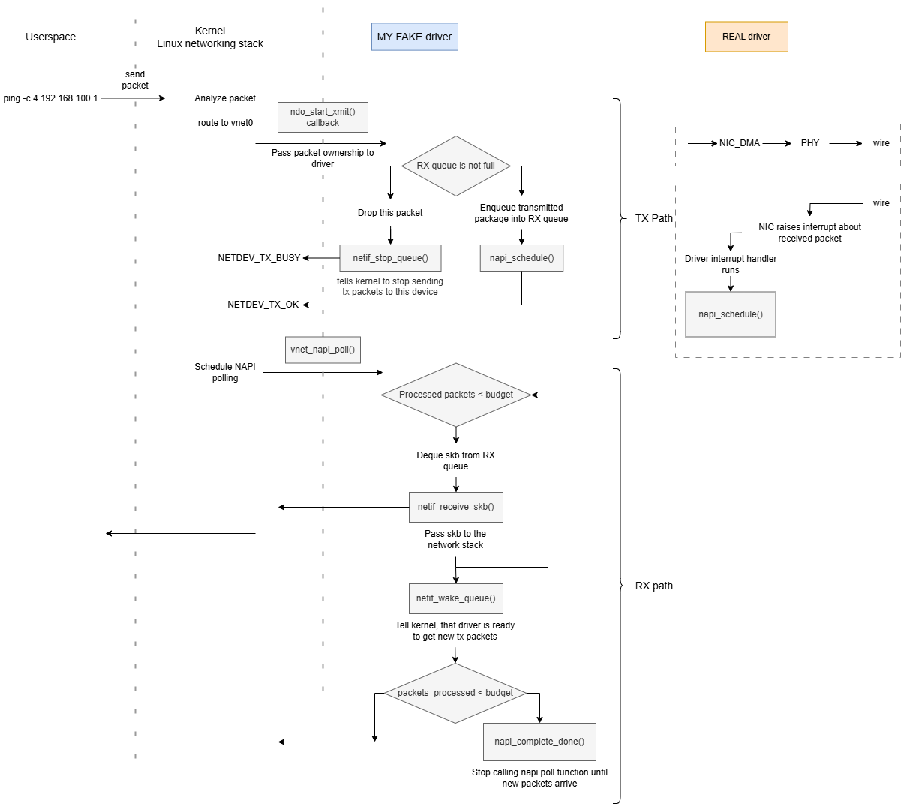

# Virtual Ethernet Loopback Driver in Linux Kernel

## What is the goal of the driver?
This driver is used to feed transmitted packages back to rx networking kernel stack.
This means, the driver receives packages for transmission from kernel, but it does not transmit to a real device, but rather eneques them in the local memory. Then the driver imitates received packages from the real device and sends to the user space the enqueued packages (the same packages it received from the kernel)

## Packet movement in the driver
On the image you can see, how package travels in the Linux. And also a diagram of the processes in the driver itself: NAPI, telling kernel, that the queue is full; restarting the acceptance of tx packages, because the queue became empty



## Restrictions
This driver is virtual and has no real hardware. Transmitted packets are stored in an internal RX queue and later injected into the kernel RX path via NAPI to simulate packet arrival from a network.


## How to build and run it?

* **Build**
```bash
cd src
make clean
make
```

* **Remove old module and load the new one into kernel**
```bash
sudo rmmod vnet_driver
sudo insmod vnet_driver.ko
```

* **Verify module is loaded**
```bash
lsmod | grep vnet_driver
```

**Expected output:**
```
vnet_driver            16384  0
```
* **Check kernel messages:**
```bash
dmesg | grep VNET | tail -5
```

**Expected output:**
```
[  123.456] VNET: vnet_init
[  123.457] VNET: vnet_setup
[  123.458] VNET: Device registered
```

* **Verify Network Interface Created**
Check that the `vnet0` interface exists:

```bash
ip link show vnet0
```
**What this does:** Displays the network interface details.

**Expected output:**
```
3: vnet0: <BROADCAST,NOARP> mtu 1500 qdisc noop state DOWN mode DEFAULT group default qlen 1000
    link/ether 02:a1:b2:c3:d4:e5 brd ff:ff:ff:ff:ff:ff
```
The interface is in `DOWN` state and has a randomly generated MAC address.

* **Configure the Interface**
Assign an IP address and bring the interface up:

```bash
sudo ip addr add 192.168.100.1/24 dev vnet0
sudo ip link set vnet0 up
```
**What this does:** 
- First command: Assigns the IP address `192.168.100.1` with subnet mask `/24` to the `vnet0` interface. So that kernel knows, which interface to use, when trying to send to the specified IP address
- Second command: Activates the interface (changes state from `DOWN` to `UP`)

**Verify configuration:**
```bash
ip addr show vnet0
```

**Expected output:**
```
3: vnet0: <BROADCAST,NOARP,UP,LOWER_UP> mtu 1500 qdisc pfifo_fast state UNKNOWN group default qlen 1000
    link/ether 02:a1:b2:c3:d4:e5 brd ff:ff:ff:ff:ff:ff
    inet 192.168.100.1/24 scope global vnet0
       valid_lft forever preferred_lft forever
```

* **Test with Ping utility**
Send ICMP echo requests to the loopback interface:

```bash
ping -c 4 192.168.100.1
```

**What this does:** Sends 4 ping packets to the interface. Since this is a loopback driver, packets are transmitted, queued internally, then received back through the NAPI poll mechanism.

**Expected output:**
```
PING 192.168.100.1 (192.168.100.1) 56(84) bytes of data.
64 bytes from 192.168.100.1: icmp_seq=1 ttl=64 time=0.123 ms
64 bytes from 192.168.100.1: icmp_seq=2 ttl=64 time=0.089 ms
64 bytes from 192.168.100.1: icmp_seq=3 ttl=64 time=0.095 ms
64 bytes from 192.168.100.1: icmp_seq=4 ttl=64 time=0.091 ms

--- 192.168.100.1 ping statistics ---
4 packets transmitted, 4 received, 0% packet loss, time 3053ms
rtt min/avg/max/mdev = 0.089/0.099/0.123/0.013 ms
```

* **Monitor Driver Activity**
In a separate terminal, watch the kernel logs to see driver activity:

```bash
sudo dmesg -w | grep VNET
```

**What this does:** Displays real-time kernel messages from the driver showing packet transmission and NAPI polling.

**Expected output during ping:**
```
[  456.123] VNET: vnet_xmit called
[  456.124] VNET: Packet enqueued to RX queue
[  456.125] VNET: vnet_napi_poll called with budget 64
[  456.126] VNET: Dequeued skb from rx_queue
[  456.127] VNET: Packet protocol after eth_type_trans: 0x0800
[  456.128] VNET: Packet passed to network stack
[  456.129] VNET: NAPI complete, no more packets
```

* **Check Interface Statistics**
View packet transmission and reception counters:

```bash
ip -s link show vnet0
```

**What this does:** Displays detailed statistics including packets transmitted/received, bytes, errors, and drops.

**Expected output:**
```
3: vnet0: <BROADCAST,NOARP,UP,LOWER_UP> mtu 1500 qdisc pfifo_fast state UNKNOWN mode DEFAULT group default qlen 1000
    link/ether 02:a1:b2:c3:d4:e5 brd ff:ff:ff:ff:ff:ff
    RX: bytes  packets  errors  dropped overrun mcast   
    336        4        0       0       0       0       
    TX: bytes  packets  errors  dropped carrier collsns 
    336        4        0       0       0       0
```
You should see equal RX and TX packet counts (loopback behavior).

* **Test with Netcat utility**
Create 2 terminals
**Terminal 1 - Start server:**
```bash
nc -l 192.168.100.1 8888
```

**Terminal 2 - Send data:**
```bash
echo "Hello loopback driver!" | nc 192.168.100.1 8888
```

**What this does:** Tests TCP packet transmission through the loopback interface. The message should appear in Terminal 1.


* **Cleanup**
When done testing, bring down the interface and remove the module:

```bash
# Bring interface down
sudo ip link set vnet0 down

# Remove IP address (optional)
sudo ip addr del 192.168.100.1/24 dev vnet0

# Unload the module
sudo rmmod vnet_driver
```

**Verify removal:**
```bash
dmesg | grep VNET | tail -5
```

**Expected output:**
```
[  789.123] VNET: vnet_release called
[  789.124] VNET: vnet_exit
